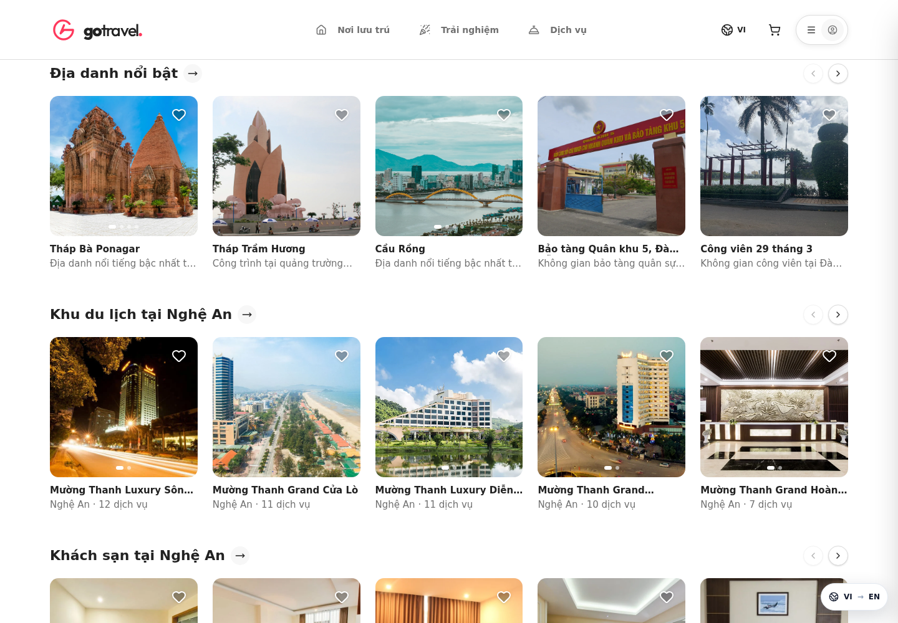
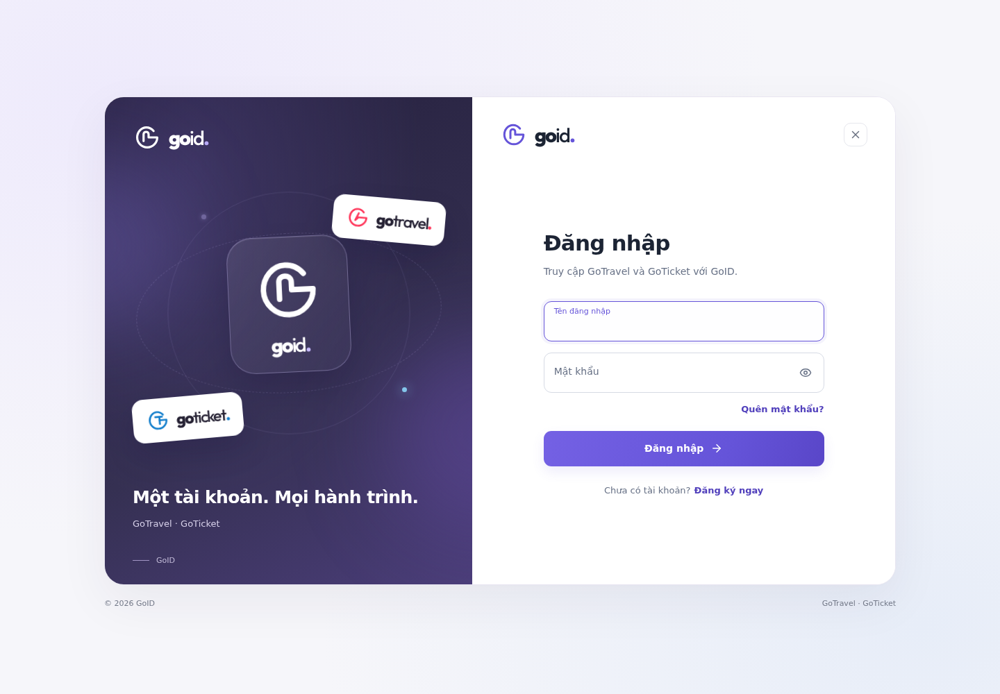
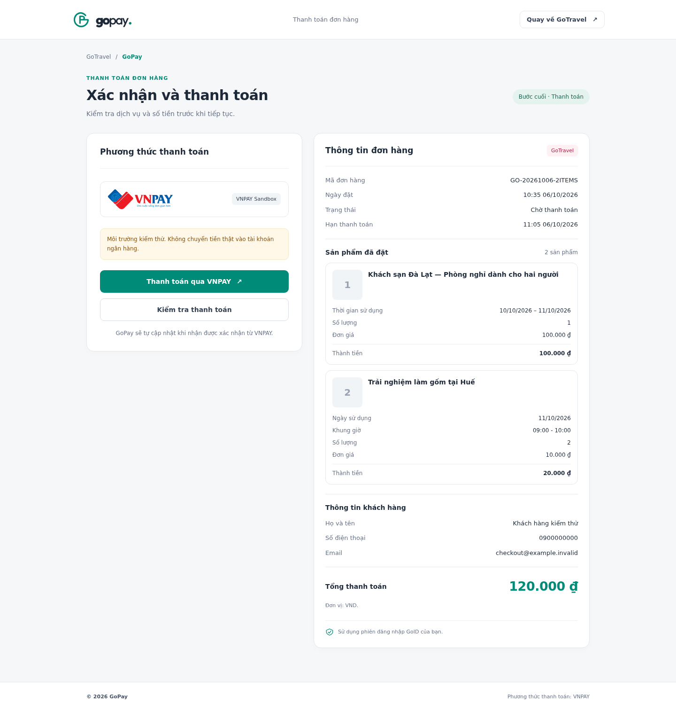
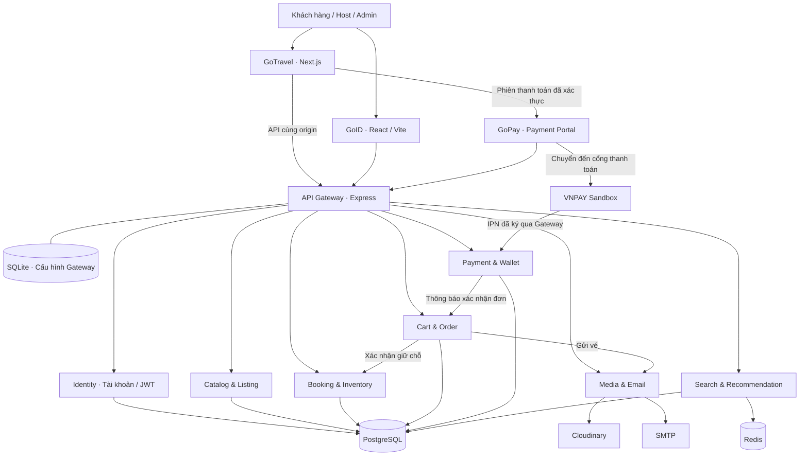

<div align="center">
  <picture>
    <source media="(prefers-color-scheme: dark)" srcset="https://raw.githubusercontent.com/namnguyenit/GoTravel/devserver/brand-assets/exports/gotravel/gotravel-lockup-white.svg">
    
  </picture>

  <h1>Một tài khoản. Mọi hành trình.</h1>
  <p>Nền tảng đặt nơi lưu trú, trải nghiệm và dịch vụ du lịch, kết nối qua GoID và GoPay.</p>

  <p>
    <a href="https://gotravel.trungcaodev.io.vn/"><strong>Khám phá GoTravel</strong></a> ·
    <a href="https://auth.trungcaodev.io.vn/"><strong>Đăng nhập GoID</strong></a> ·
    <a href="https://pay.trungcaodev.io.vn/"><strong>GoPay</strong></a>
  </p>
  <p><a href="https://github.com/namnguyenit/GoTravel/tree/devserver">Mã nguồn đang phát triển</a> · <a href="#kiến-trúc-hệ-thống">Kiến trúc</a> · <a href="#chạy-dự-án">Chạy dự án</a> · <a href="#tài-liệu">Tài liệu</a></p>
</div>

---

## Giới thiệu

GoTravel giúp người dùng tìm và đặt nơi lưu trú, trải nghiệm, dịch vụ riêng lẻ hoặc dịch vụ trong một tổ hợp du lịch. Host cá nhân và doanh nghiệp quản lý dịch vụ, lịch khả dụng và đơn đặt; quản trị viên xử lý hồ sơ, quyền và cấu hình hệ thống.

Dự án được thiết kế thành nhiều dịch vụ độc lập. **GoID** quản lý tài khoản dùng chung; **GoPay** xử lý thanh toán. **GoTicket** là sản phẩm đang chuẩn bị tích hợp cho vé xe khách, máy bay, tàu hỏa và nội dung du lịch.

> Các liên kết trên phục vụ môi trường demo. VNPAY hiện dùng **Sandbox**; giá, lịch khả dụng và tài khoản seed phục vụ kiểm thử, không đại diện cho tồn chỗ thực tế của cơ sở bên ngoài.

## Hệ sinh thái

| Sản phẩm | Vai trò | Truy cập |
| --- | --- | --- |
| **GoTravel** | Tìm kiếm và đặt nơi lưu trú, trải nghiệm, dịch vụ du lịch | [gotravel.trungcaodev.io.vn](https://gotravel.trungcaodev.io.vn/) |
| **GoID** | Đăng nhập, đăng ký, khôi phục tài khoản và phiên SSO dùng chung | [auth.trungcaodev.io.vn](https://auth.trungcaodev.io.vn/) |
| **GoPay** | Thanh toán đơn hàng qua VNPAY và theo dõi kết quả giao dịch | [pay.trungcaodev.io.vn](https://pay.trungcaodev.io.vn/) |
| **GoTicket** | Vé vận chuyển và nội dung du lịch; đang phát triển, chưa tích hợp hoàn chỉnh | [Repository GoTicket](https://github.com/namnguyenit/GoTicket) |

GoPay được mở từ bước thanh toán của một đơn hàng đã xác thực. Trang chủ GoPay không tạo phiên thanh toán cho một mã đơn tùy ý.

## Giao diện sản phẩm

### GoTravel



<details>
<summary><strong>GoID — đăng nhập và tài khoản dùng chung</strong></summary>



</details>

<details>
<summary><strong>GoPay — thanh toán đơn nhiều sản phẩm</strong></summary>

Ảnh minh họa giao diện với dữ liệu kiểm thử.



</details>

## Tính năng

### Khách hàng

- Khám phá địa điểm, nơi lưu trú, trải nghiệm, dịch vụ và tổ hợp du lịch; tìm kiếm theo nhu cầu.
- Xem mô tả, ảnh, đánh giá, lịch sử dụng và các dịch vụ liên quan.
- Chọn ngày, khung giờ, số lượng; đặt trực tiếp hoặc chọn nhiều sản phẩm trong giỏ hàng.
- Kiểm tra đầy đủ từng sản phẩm, thông tin người đặt và tổng tiền trước khi thanh toán qua GoPay.
- Xem lịch sử mua hàng dưới dạng các ô đơn riêng; tìm mã đơn/tên dịch vụ, lọc trạng thái và phân trang.
- Mở chi tiết đơn, xem mã QR được mã hóa từ mã đơn, trạng thái email vé và gửi yêu cầu khiếu nại.

### Host và quản trị

- Hồ sơ host cá nhân/doanh nghiệp, đăng ký quyền và quy trình quản trị viên xét duyệt.
- Quản lý danh mục dịch vụ, tổ hợp, lịch khả dụng, đơn hàng và thông tin kinh doanh.
- Gateway Studio: quản lý node service, ánh xạ API, phương thức HTTP, xác thực, quyền và giới hạn lưu lượng.
- Lưu cấu hình Gateway trực tiếp vào SQLite, áp dụng cho request mới, theo dõi lịch sử phiên bản và khôi phục cấu hình.

### Tài khoản và thanh toán

- Phiên GoID dùng cookie **HttpOnly**, kiểm tra JWT và CSRF cho các luồng cookie thay đổi dữ liệu.
- Chọn đúng miền SSO/GoPay theo miền sản phẩm; giữ hỗ trợ miền cũ và chặn chuyển hướng công khai về `localhost`.
- VNPAY: ký yêu cầu, xác minh IPN/Return, kiểm tra merchant, mã tham chiếu, số tiền và trạng thái giao dịch.
- Xử lý thông báo lặp, xác nhận giữ chỗ và chuyển giao dịch cần kiểm tra sang trạng thái đối soát.
- Vé email qua SMTP; QR được tạo cục bộ và đính kèm trong email, không gửi mã đơn sang dịch vụ tạo QR bên ngoài.

## Kiến trúc hệ thống



Đây là sơ đồ các luồng chính. Backend gọi chéo qua API nội bộ với token dịch vụ; quyền sở hữu tài nguyên và điều kiện nghiệp vụ tiếp tục được kiểm tra tại service.

### Công nghệ và module

| Module | Công nghệ | Chức năng |
| --- | --- | --- |
| `front_end` | Next.js 16, React 19, TypeScript, Tailwind CSS | GoTravel, giao diện khách hàng/host/admin |
| `auth_front-end` | React, TypeScript, Vite | GoID |
| `payment_portal` | Node.js HTTP server, HTML/CSS/JavaScript | GoPay, handoff thanh toán, trang kết quả |
| `APIGateway` | Node.js 22, Express 5, better-sqlite3 | Routing động, JWT, CSRF, rate limit, Gateway Studio |
| `Identity` | Java, Spring Boot, Spring Security | Tài khoản, quyền, JWT/JWKS |
| `CatalogandListing` | Java, Spring Boot, JPA, Flyway | Danh mục, dịch vụ, địa điểm và tổ hợp |
| `BookingandInventory` | Java, Spring Boot, JPA | Tồn chỗ, giữ chỗ, lịch và xác nhận đặt |
| `CartandOrder` | Java, Spring Boot, JPA | Giỏ hàng, đơn hàng, lịch sử và vé |
| `PaymentandWallet` | Java, Spring Boot, JPA | VNPAY, giao dịch, ví và thông báo đơn |
| `cloudinary-service` | Express, Cloudinary, Nodemailer, QRCode | Ảnh và email vé |
| `search-and-recommendation` | NestJS, PostgreSQL, Redis | Tìm kiếm và gợi ý |
| `api-tester/e2e-seeder` | Script và dữ liệu seed | Kiểm thử API, bổ sung dữ liệu, quản lý nguồn ảnh |
| `brand-assets` | SVG, PNG, font và script xuất tài nguyên | Bộ nhận diện GoTravel, GoTicket, GoID, GoPay |

## Chạy dự án

Mã đang phát triển và triển khai nằm trên nhánh **`devserver`**. Các module có cấu hình và dependency riêng; dự án hiện chưa có một lệnh bootstrap chung được xác minh cho mọi môi trường.

### 1. Yêu cầu

- **Node.js 22+**, npm.
- **JDK 17+** tương thích với các module Spring Boot, Maven hoặc Maven Wrapper. Server hiện được kiểm tra với JDK 21.
- **PostgreSQL**, các database/role theo cấu hình từng service; module Catalog sử dụng các extension PostgreSQL theo migration.
- **Redis** cho search/recommendation.
- Tài khoản Cloudinary, cấu hình SMTP và merchant VNPAY Sandbox nếu dùng các tích hợp tương ứng.

### 2. Clone và cấu hình

```bash
git clone --branch devserver https://github.com/namnguyenit/GoTravel.git
cd GoTravel
```

Các cấu hình cần chuẩn bị:

| Thành phần | Mẫu / hướng dẫn |
| --- | --- |
| JWT Identity | [`Identity/.env.example`](https://github.com/namnguyenit/GoTravel/blob/devserver/Identity/.env.example); tạo khóa riêng ngoài Git bằng `bash setup-linux.sh keystore` |
| Gateway | [`APIGateway/.env.example`](https://github.com/namnguyenit/GoTravel/blob/devserver/APIGateway/.env.example); đặt token nội bộ, CSRF secret, bind host và upstream cho môi trường |
| Database Java | `src/main/resources/database.yaml` của từng module; cấu hình database/user/password theo môi trường |
| Cloudinary / SMTP | [`cloudinary-service/.env.example`](https://github.com/namnguyenit/GoTravel/blob/devserver/cloudinary-service/.env.example) |
| Search / Redis | [`search-and-recommendation/.env.example`](https://github.com/namnguyenit/GoTravel/blob/devserver/search-and-recommendation/.env.example) |
| GoTravel | [`front_end/.env.example`](https://github.com/namnguyenit/GoTravel/blob/devserver/front_end/.env.example); API cùng origin được proxy tới Gateway |
| VNPAY | [`PaymentandWallet/vnpay-local.yaml.example`](https://github.com/namnguyenit/GoTravel/blob/devserver/PaymentandWallet/vnpay-local.yaml.example) → `.secrets/vnpay-local.yaml`; xem [hướng dẫn VNPAY](https://github.com/namnguyenit/GoTravel/blob/devserver/document/VNPAY_SANDBOX_SETUP_2026-10-06.md) |

`.env`, keystore, token nội bộ và merchant secret là cấu hình riêng của môi trường. Token nội bộ cần thống nhất giữa các service gọi nhau. Các script triển khai trong `deploy/` hiện có đường dẫn đặc thù của server nhóm; cần điều chỉnh trước khi dùng trên máy khác.

Nếu dùng `setup-linux.sh setup-db` hoặc `env`, phải cung cấp `APP_DB_PASSWORD`, `CATALOG_READER_PASSWORD`, `RECOMMENDATION_DB_PASSWORD` qua môi trường. Script không cấp mật khẩu mặc định.

### 3. Cài dependency và chạy từng module

Ví dụ Gateway, chạy trong thư mục `APIGateway`:

```bash
npm ci
npm start
```

Ví dụ backend Java, chạy trong module tương ứng, chẳng hạn `Identity`:

```bash
./mvnw spring-boot:run
```

Ví dụ GoTravel, chạy trong `front_end`:

```bash
npm ci
npm run dev
```

GoID dùng `npm ci` và `npm run dev` trong `auth_front-end`. GoPay dùng `npm start` trong `payment_portal`. Media dùng `npm ci`/`npm start`; Search dùng `npm ci`/`npm run start:dev` trong module tương ứng. Các service cần được cấu hình database, khóa JWT và token nội bộ trước khi chạy luồng đặt hàng.

### Cổng mặc định

| Thành phần | Cổng | Địa chỉ local |
| --- | --- | --- |
| GoTravel | 3000 | `http://localhost:3000` |
| GoID | 3335 | `http://localhost:3335` |
| GoPay | 3336 | `http://localhost:3336` |
| API Gateway / Gateway Studio | 5555 | `http://localhost:5555/admin/gateway` — dữ liệu quản trị yêu cầu quyền admin |
| Media / Email | 5001 | API nội bộ |
| Identity | 8080 | API backend |
| Catalog / Booking / Cart / Payment / Search | 8082–8086 | API backend |

Trong triển khai server, tunnel/proxy công khai đưa request tới ứng dụng; các backend nghiệp vụ sử dụng địa chỉ nội bộ. Cổng frontend 3000 không phải cổng Gateway Studio.

## Kiểm thử

Chạy từ thư mục gốc với Node.js 22:

```bash
npm --prefix APIGateway test
npm --prefix payment_portal test
node --experimental-strip-types --test deploy/domain-routing.test.mjs
```

Trong `PaymentandWallet`, chạy `./mvnw test` để kiểm tra VNPAY. Trong `BookingandInventory` và `CartandOrder`, các bộ `PaymentInventoryConfirmationTest` và `OrderPaymentConfirmationTest` kiểm tra điều kiện xác nhận giữ chỗ/đơn hàng.

Các báo cáo kiểm tra trình duyệt, API và VNPAY Sandbox được lưu trong `document/`. Kết quả một bộ test hoặc một lần kiểm tra không đại diện cho toàn bộ hệ thống; trạng thái và phạm vi kiểm tra nằm trong từng báo cáo.

## Tài liệu

| Chủ đề | Tài liệu |
| --- | --- |
| Các cập nhật kỹ thuật gần nhất | [Báo cáo kỹ thuật 06/10/2026](https://github.com/namnguyenit/GoTravel/blob/devserver/document/TECHNICAL_UPDATES_2026-10-06.md) |
| Gateway động, SQLite và vận hành | [Gateway động](https://github.com/namnguyenit/GoTravel/blob/devserver/document/API_GATEWAY_DYNAMIC_SQLITE.md) |
| Node service, REST và bảo mật Gateway | [Cấu hình REST và bảo mật](https://github.com/namnguyenit/GoTravel/blob/devserver/document/API_GATEWAY_SERVICE_NODES_REST_SECURITY.md) |
| VNPAY Sandbox / Return / IPN | [Cấu hình và kiểm thử VNPAY](https://github.com/namnguyenit/GoTravel/blob/devserver/document/VNPAY_SANDBOX_SETUP_2026-10-06.md) |
| Lịch sử đơn, QR và SMTP | [Đơn hàng và email vé](https://github.com/namnguyenit/GoTravel/blob/devserver/document/ORDER_HISTORY_QR_EMAIL_2026-10-06.md) |
| Thanh toán nhiều sản phẩm | [GoID, GoPay và giao diện đơn hàng](https://github.com/namnguyenit/GoTravel/blob/devserver/document/CHECKOUT_ECOSYSTEM_2026-10-06.md) |
| Bộ nhận diện | [Go brand family](https://github.com/namnguyenit/GoTravel/blob/devserver/document/GO_BRAND_FAMILY_2026-10-06.md) |
| Dữ liệu địa điểm và ảnh | [Catalog dữ liệu thật](https://github.com/namnguyenit/GoTravel/blob/devserver/document/GOTRAVEL_REAL_CATALOG_2026-10-05.md) |
| Tên miền và tunnel | [Cấu hình Cloudflare](https://github.com/namnguyenit/GoTravel/blob/devserver/document/CLOUDFLARE_NEW_DOMAIN_SETUP_2026-10-06.md) |

## Phạm vi phát triển

GoTravel, GoID và GoPay đang được triển khai để phát triển và kiểm thử. GoTicket được quản lý tại repository riêng và đang chuẩn bị tích hợp tài khoản/quyền dùng chung. GoCar là module thử nghiệm, chưa thuộc phạm vi hoàn thiện sản phẩm hiện tại.

Merchant Production, nguồn tồn chỗ thực tế và SMTP của môi trường cần được cấu hình/xác minh riêng trước khi vận hành thương mại. Bộ ảnh thương hiệu gốc nằm trong `brand-assets`; font Outfit được phân phối kèm [SIL Open Font License](https://github.com/namnguyenit/GoTravel/blob/devserver/brand-assets/OFL-Outfit.txt).
