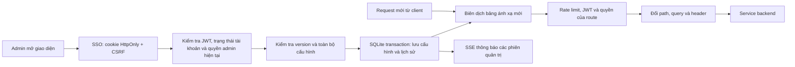

# API Gateway động: cấu hình, giao diện và vận hành

Ngày cập nhật: **04/10/2026**. Áp dụng cho phiên bản Gateway trên nhánh `devserver`.

## 1. Kết quả thay đổi

Gateway dùng **SQLite làm nguồn cấu hình chính** cho service, route và chính sách. Các tệp route JavaScript cũ đã được thay bằng bộ thực thi proxy dùng chung. Toàn bộ 69 route ban đầu được chuyển thành dữ liệu và có thể sửa, bật/tắt hoặc xóa trên giao diện.

Giao diện: **`http://localhost:5555/admin/gateway`** trên máy chủ. Trong mạng Tailscale của nhóm: **`http://100.100.181.60:5555/admin/gateway`** nếu máy truy cập được phép kết nối tới server. Cổng 3000 thuộc frontend GoTravel.

Đăng nhập bằng tài khoản SSO có `ROLE_ADMIN`. Mã HTML của trang quản trị có thể tải khi chưa đăng nhập; dữ liệu cấu hình và mọi thao tác quản trị đều yêu cầu xác thực và quyền admin.

## 2. Luồng hoạt động



Nhấn **Lưu và áp dụng** sẽ kiểm tra cấu hình, ghi transaction và kích hoạt phiên bản mới. Không cần sửa JS, build lại hoặc restart Gateway cho các cấu hình bên dưới. Request đã bắt đầu tiếp tục dùng ánh xạ đã chọn; request tiếp theo dùng phiên bản vừa lưu. Bộ đếm rate limit không bị xóa khi sửa cấu hình khác không liên quan.

Nếu dữ liệu không hợp lệ hoặc phiên bản đã đổi, thao tác bị từ chối và cấu hình đang chạy được giữ nguyên. Mỗi lần lưu có `version`, thời gian, tài khoản thực hiện và lý do thay đổi.

## 3. Những gì chỉnh được trên giao diện

### 3.1. Màn hình Ánh xạ API

- Tìm theo tên, đường dẫn hoặc service; lọc theo service và loại xác thực.
- Mỗi hàng hiển thị HTTP method, đường dẫn Gateway, địa chỉ backend, path backend, chính sách và trạng thái.
- Bấm hàng để mở bảng cấu hình chi tiết. Có thêm mới, nhân bản, bật/tắt và xóa route.
- Xuất/nhập toàn bộ cấu hình JSON. Nhập cấu hình cũng phải qua kiểm tra, version và transaction.

### 3.2. Các nhóm cấu hình của một route

| Nhóm | Trường và ý nghĩa |
| --- | --- |
| Thông tin | Tên, mô tả, service đích, trạng thái bật/tắt. ID cố định khi sửa. |
| HTTP method | Một hoặc nhiều `GET`, `POST`, `PUT`, `PATCH`, `DELETE`, `HEAD`, `OPTIONS`. Chỉ method được khai báo mới khớp. |
| Khớp đường dẫn | `exact`: endpoint chính xác, hỗ trợ `:param`; `prefix`: namespace và phần đường dẫn còn lại. |
| Ánh xạ | `sourcePath` bên Gateway → `upstreamPath` bên backend. Tham số backend phải được khai báo ở đường dẫn Gateway. |
| Tham số | `segment`, `uuid` hoặc `number` cho từng tham số. Không cho nhập regex hoặc JS tùy ý. |
| Ưu tiên | -1000 đến 1000; số lớn được xét trước. Khi bằng nhau, đường dẫn có nhiều đoạn cố định và cụ thể hơn được xét trước. Route chồng lấn cùng độ ưu tiên và độ cụ thể bị từ chối. |
| Xác thực | `jwt` hoặc `public`. Route `public` phải là `exact`, không dùng quyền vai trò hoặc namespace đặc quyền. |
| Vai trò | Danh sách `ROLE_*`; chỉ cần có một quyền trong danh sách. Danh sách rỗng nghĩa là JWT hợp lệ, backend tiếp tục kiểm tra quyền nghiệp vụ. |
| JWT tới backend | Chuyển tiếp Bearer token đã xác minh hoặc bỏ Authorization. Route public luôn bỏ Authorization. |
| Timeout | 100–120000 ms; quá hạn trả 504, không kết nối được trả 503. |
| Rate limit | Bật/tắt; số request/IP/cửa sổ; cửa sổ 1 giây đến 24 giờ. Vượt mức trả 429 và `Retry-After`. |
| Query | Giữ hoặc bỏ query đầu vào; xóa các tên được chọn; gán giá trị cấu hình sau bước xóa. |
| Header request | Gán/xóa header tùy chỉnh được phép. |
| Header response | Gán/xóa header phản hồi được phép. |
| Host backend | `changeOrigin`: Host của request tới backend theo origin backend hoặc giữ Host ban đầu. |
| Thử ánh xạ | Nhập method và URL mẫu để xem route được chọn, URL đích, xác thực, quyền và timeout. Thử ánh xạ không gửi request nghiệp vụ tới backend. |

Đường dẫn `exact` chấp nhận một dấu `/` cuối URL. Với `prefix`, phần còn lại được giữ khi chuyển tiếp. Ví dụ:

```text
Service ticket: http://127.0.0.1:8090
Route exact:
  GET /api/v1/tickets/orders/:id
   -> /api/orders/:id
Query giữ lại, xóa debug, gán channel=platform

GET http://localhost:5555/api/v1/tickets/orders/42?page=2&debug=1
 -> GET http://127.0.0.1:8090/api/orders/42?page=2&channel=platform

Route prefix:
  /api/v1/tickets -> /api/tickets
GET /api/v1/tickets/routes/12/seats
 -> GET http://127.0.0.1:8090/api/tickets/routes/12/seats
```

`8090` trong ví dụ là cổng minh họa. GoTicket chưa được triển khai backend theo ví dụ này.

### 3.3. Màn hình Services

Thêm service mới, sửa tên/mô tả, địa chỉ HTTP(S) origin và trạng thái. Thay địa chỉ một service cập nhật tất cả route tham chiếu tới service đó ngay khi lưu. Trạng thái kết nối là kiểm tra TCP ngắn, **không phải xác nhận toàn bộ chức năng nghiệp vụ khỏe mạnh**.

- Mã service không đổi sau khi tạo.
- Service phải có URL hợp lệ trước khi bật.
- Xóa service còn được route tham chiếu sẽ bị từ chối; cần chuyển/xóa các route liên quan trước.
- Identity phải luôn tồn tại, được cấu hình và bật để quản trị tiếp tục xác thực.
- Đổi Identity cập nhật cả JWKS, kiểm tra trạng thái tài khoản, kiểm tra quyền admin, đăng nhập và refresh vai trò; không còn phụ thuộc địa chỉ cũ trong biến môi trường sau khởi tạo.

### 3.4. Màn hình Chính sách

- Danh sách CORS origin chính xác; không dùng `*` cho phiên cookie.
- Domain cookie SSO. Trên localhost/Tailscale, Gateway dùng cookie theo host khi domain chia sẻ không phù hợp.
- Tuổi phiên cookie: 5–480 phút. Giới hạn mới cũng được kiểm tra trên JWT cookie ở request tiếp theo.
- Giới hạn đăng nhập: 1–30 request/IP/cửa sổ, cửa sổ 1 phút đến 24 giờ.
- Bật/tắt kiểm tra quốc gia và danh sách mã quốc gia hai chữ.

Chính sách quốc gia dựa trên `cf-ipcountry` khi có header. Cơ chế này chỉ có giá trị bảo vệ nếu đường truy cập tới Gateway và proxy tin cậy được kiểm soát; nó không thay thế firewall hoặc ACL Tailscale. Client đi trực tiếp có thể không có header quốc gia.

Đổi domain cookie áp dụng cho lần cấp/xóa cookie sau đó; cookie cũ ở domain trước có thể còn tồn tại tới khi hết hạn. Cần lên kế hoạch đăng nhập lại nếu đổi domain của môi trường đang hoạt động.

### 3.5. Lịch sử và realtime

Giữ **100 phiên bản gần nhất**. Khôi phục phiên bản cũ tạo một phiên bản mới, có audit, không giảm số version và không xóa bằng chứng thay đổi.

SSE đồng bộ version giữa các cửa sổ. Nếu đang sửa bản nháp, giao diện giữ bản nháp và báo có cấu hình mới. Lưu với version cũ trả **409** để tránh ghi đè thay đổi của người khác. Kết nối SSE được đóng định kỳ mỗi phút để lần kết nối tiếp theo phải xác minh lại quyền; giao diện tự kết nối lại.

## 4. Cấu trúc SQLite và bảo đảm dữ liệu

Thư viện `better-sqlite3`; yêu cầu **Node.js 22 trở lên**. Schema version hiện tại: **1**.

| Bảng | Dữ liệu |
| --- | --- |
| `meta` | Version đang chạy và thời gian cập nhật. |
| `services` | Mã service và cấu hình JSON. |
| `routes` | ID, tham chiếu service qua foreign key, cấu hình JSON. |
| `settings` | Chính sách Gateway. |
| `revisions` | Snapshot của cấu hình, version, người sửa, thời gian và lý do. |

Database chạy WAL, bật foreign key, `busy_timeout=5000`. Thao tác sửa dùng `BEGIN IMMEDIATE`; version được kiểm tra bên trong transaction. Đọc lại cấu hình dùng read transaction để các bảng và meta thuộc cùng một snapshot, kể cả khi tiến trình khác ghi đồng thời.

Trên server này đặt database tại:

```text
/home/DoANLienNganh/APIGateway/.data/gateway.sqlite
```

Database, WAL và SHM không được đưa lên Git. Tệp cấu hình được đặt quyền nhóm 660; thư mục chia sẻ hiện dùng 2770. SQLite không lưu private key JWT, mật khẩu, token nội bộ hoặc CSRF secret.

### Khởi tạo và chuyển dữ liệu cũ

1. Database trống: lấy 69 route từ `src/gateway/default-config.json`; service URL và chính sách khởi tạo lấy từ `.env` nếu có.
2. Nếu `GATEWAY_ROUTES_FILE` trỏ tới JSON cũ có tồn tại, nhập thêm các route động từ JSON trong cùng transaction. Các route này mặc định yêu cầu JWT.
3. JSON hỏng hoặc cấu hình không hợp lệ làm khởi tạo thất bại; không âm thầm bỏ dữ liệu cũ.
4. Sau khi đã có meta, lần khởi động sau chỉ dùng SQLite. Seed/JSON/biến URL service không ghi đè cấu hình đã lưu. Route đã xóa không tự xuất hiện lại.
5. Có thể giữ JSON cũ để đối chiếu; không cần xóa để chạy phiên bản mới.

## 5. API quản trị

Base URL: `/api/v1/gateway-admin`. Tất cả endpoint yêu cầu JWT admin, trạng thái tài khoản hợp lệ và vai trò admin hiện tại đọc từ Identity `/api/users/me`. Nếu Identity không xác minh được quyền, từ chối quản trị bằng 503; không cho đi tiếp.

| Method | Path | Chức năng |
| --- | --- | --- |
| GET | `/overview` | Cấu hình và trạng thái TCP của service. |
| GET | `/config` | Snapshot đầy đủ với version. |
| GET | `/revisions` | Danh sách lịch sử. |
| GET | `/events` | SSE version và heartbeat. |
| POST | `/preview` | Thử ánh xạ cấu hình đang chạy hoặc bản nháp route. |
| POST | `/routes`, `/services` | Thêm mục. Body `{version, item}`. |
| PUT | `/routes/:id`, `/services/:key` | Sửa mục. Body `{version, item}`. |
| DELETE | `/routes/:id`, `/services/:key` | Xóa mục. Body `{version}`. |
| PUT | `/settings` | Body `{version, settings}`. |
| PUT | `/config` | Nhập toàn bộ cấu hình. Body `{version, config}`. |
| POST | `/revisions/:version/restore` | Khôi phục revision trong URL. Body chứa version **hiện tại**. |

Response thành công có `{status: 200, data: ...}`. Lỗi thường gặp: 400 cấu hình không hợp lệ; 401 chưa có phiên; 403 thiếu quyền/CSRF; 409 xung đột version; 413 body quá lớn; 503 không xác minh được quyền hoặc không ghi được cấu hình. Request quản trị JSON tối đa 1 MB.

Ví dụ dữ liệu một route (khi POST cần bọc bằng `{version, item}`):

```json
{
  "id": "01234567-89ab-4cde-8fab-0123456789ab",
  "name": "GoTicket: chi tiết đơn",
  "description": "Ánh xạ đơn vé; backend kiểm tra chủ sở hữu đơn",
  "methods": ["GET"],
  "matchType": "exact",
  "sourcePath": "/api/v1/tickets/orders/:id",
  "upstreamPath": "/api/orders/:id",
  "serviceKey": "ticket",
  "enabled": true,
  "auth": "jwt",
  "roles": [],
  "priority": 0,
  "timeoutMs": 15000,
  "changeOrigin": true,
  "preserveQuery": true,
  "forwardAuthorization": true,
  "paramTypes": { "id": "number" },
  "query": { "set": { "channel": "platform" }, "remove": ["debug"] },
  "headers": {
    "request": { "x-route-name": "ticket-order" },
    "response": {},
    "removeRequest": [],
    "removeResponse": []
  },
  "rateLimit": { "enabled": true, "limit": 100, "windowMs": 60000 }
}
```

## 6. Những ràng buộc bảo mật được giữ

- JWT RS256, issuer `com.gotravel.identity`, audience `gotravel-api`; không cho UI đổi thuật toán để bỏ qua xác thực.
- Cookie access token HttpOnly; thao tác ghi dùng cookie phải có CSRF hợp lệ và origin tin cậy. UI không đọc/lưu JWT vào localStorage.
- Xóa header `x-internal-*`, `x-user-*` từ client; chỉ tạo thông tin user sau xác minh JWT.
- Proxy không chuyển cookie/CSRF tới backend, không cho backend tự cấp cookie qua route proxy thông thường.
- Không cho cấu hình ghi đè/xóa header xác thực, token nội bộ, user, forwarded, Cloudflare, cookie, CORS hoặc header liên quan framing của HTTP.
- Route public không mở toàn namespace; chỉ endpoint và method đã cấu hình. Namespace `admin`, `host`, `me` không được ánh xạ công khai.
- Chặn `internal`, `actuator` và API điều khiển; chặn đường dẫn mã hóa nguy hiểm, traversal và slash lồng.
- Endpoint đăng nhập/refresh cấp phiên chỉ đi qua handler SSO của Gateway, không được tạo route thay thế để trả JWT thô về browser.
- Upstream chỉ dùng HTTP(S) origin, không user/password/query/path. Host phải được duyệt ở `GATEWAY_UPSTREAM_HOSTS` hoặc nằm trong danh sách host service khởi tạo. Không chấp nhận địa chỉ metadata cloud và không trỏ về cổng Gateway ở loopback.
- UI dùng `textContent` cho dữ liệu động, không render HTML từ tên/mô tả/config. CSP không cho script inline hoặc frame nhúng trang quản trị.
- Backend vẫn phải xác minh token và quyền đối tượng: chủ sở hữu đơn, listing, hồ sơ nhà xe… Gateway không đủ dữ liệu để thay kiểm tra nghiệp vụ này.

**Cấu hình được sửa realtime:** service, route, method, path, tham số, quyền route, timeout, rate limit, query, header, CORS, tuổi phiên và chính sách quốc gia.

**Thiết lập vận hành vẫn ở môi trường triển khai:** địa chỉ/cổng bind, đường dẫn database, trusted proxy, allowlist host upstream, token nội bộ, CSRF secret và khóa ký của Identity. Các thiết lập này cần restart hoặc quy trình luân chuyển bí mật. Chúng không được đưa lên UI để một thao tác nhầm có thể mở proxy tới mọi host hoặc làm lộ bí mật.

## 7. Sao lưu và khôi phục

### Sao lưu đang chạy

Dùng SQLite backup API để lấy snapshot nhất quán khi database đang dùng WAL:

```bash
cd /home/trungcao/DoANLienNganh-devserver/APIGateway
PATH=/home/nhan/.nodejs-22/bin:$PATH npm run config:backup -- /duong-dan-backup/gateway-2026-10-04.sqlite
```

`GATEWAY_CONFIG_DB` phải được cấu hình trong `.env` hoặc môi trường. Script không khởi tạo lại database; nguồn phải tồn tại. Tệp backup đặt quyền 600. Không sao chép riêng tệp `.sqlite` đang chạy mà bỏ WAL.

### Khôi phục cấu hình nghiệp vụ

Ưu tiên **Lịch sử phiên bản → Khôi phục** hoặc nhập JSON đã xuất trên UI. Cả hai có version và audit, áp dụng ngay.

Nếu cần phục hồi database do hỏng/di chuyển máy: dừng Gateway, giữ bản sao cả database/WAL/SHM hiện tại, thay database bằng backup nhất quán, bảo đảm owner/group/quyền ghi đúng, rồi khởi động Gateway. Không thay tệp live khi tiến trình đang giữ kết nối SQLite. JSON export không chứa lịch sử; backup SQLite có lịch sử còn được giữ tại thời điểm sao lưu.

## 8. Giới hạn và lưu ý vận hành

1. SQLite phù hợp với Gateway hiện tại trên **một máy chủ**, lưu cấu hình không phải log từng request. Các worker cùng máy có thể dùng cùng database; runtime kiểm tra meta version ở request kế tiếp, SSE kiểm tra lại trong heartbeat tối đa 10 giây nếu thay đổi từ tiến trình khác.
2. Rate limit hiện lưu trong RAM của từng tiến trình. Restart làm mất bộ đếm; khi chạy nhiều replica cần dùng kho dùng chung như Redis. Không chia sẻ SQLite qua filesystem mạng để xây hệ nhiều máy.
3. Đổi địa chỉ Identity cần kiểm tra trước rằng dịch vụ mới có JWKS, issuer/audience, trạng thái tài khoản và API hồ sơ tương thích. Sửa nhầm có thể làm đăng nhập/admin mất kết nối; có thể dùng backup hoặc tài khoản admin còn phiên hợp lệ để phục hồi nếu Identity mới vẫn xác minh được.
4. Quyền quản trị SQLite rất mạnh: chỉ cấp cho admin vận hành đáng tin cậy. Không công khai bảng điều khiển ra Internet nếu nhóm chỉ cần truy cập qua Tailscale hoặc SSH tunnel.
5. GeoIP không đảm bảo chặn truy cập đi trực tiếp tới Gateway. Firewall/ACL của server phải được quản lý riêng.
6. Phiên bản này không thêm load balancing nhiều upstream, retry tự động, circuit breaker, WebSocket proxy hoặc quy trình duyệt cấu hình nhiều cấp. Không tự retry thao tác đặt vé/thanh toán vì có thể tạo giao dịch trùng.
7. `npm audit` sau cập nhật dependency còn 3 mục high trong cùng chuỗi `braces → micromatch → http-proxy-middleware`. Gateway không dùng glob hoặc `pathFilter` lấy từ client/config, giảm khả năng chạm tới nhánh lỗi này; chưa thể coi dependency hoàn toàn sạch. Không hạ thư viện về bản rất cũ theo đề nghị `audit --force`.
8. Server chung còn vấn đề lưu trạng thái PM2 qua reboot: `/home/nhan/.pm2/dump.pm2` thuộc `nhan`, tài khoản hiện tại không có quyền ghi. Chủ daemon/root cần chạy `PM2_HOME=/home/nhan/.pm2 pm2 save` sau khi xác nhận danh sách process hiện tại. Việc đổi route không cần `pm2 save`; vấn đề này liên quan việc tự khởi động đúng đường dẫn ứng dụng sau reboot.

## 9. Kiểm chứng

- **18 test tự động đã qua**: SQLite thật, chuyển dữ liệu JSON một lần, không tái sinh route đã xóa, persistence/reload, conflict giữa registry, sửa route/service realtime, đổi Identity, JWT/quyền, thu hồi admin, CSRF, header/query/body proxy, rate limit, timeout, SSE, rollback, CORS/quốc gia/tuổi phiên/giới hạn đăng nhập động và chặn cấu hình nguy hiểm.
- Kiểm thử Chromium bằng thao tác giao diện thật: đăng nhập, 69 route, thêm và thử ánh xạ, chỉnh query/rate limit, đổi backend, hai cửa sổ với bản nháp và conflict, lịch sử khôi phục, giao diện mobile 390px, không có lỗi JavaScript.
- Chạy bản ứng viên loopback cổng 5556 với các backend thật và so sánh bản đang chạy: health/UI/catalog landmarks/search trả 200; session/admin không đăng nhập trả 401; API nội bộ bị chặn. Endpoint chưa khai báo `/api/v1/recommendations/popular` vẫn trả 404.
- Không kiểm thử giao dịch thanh toán hoặc phát triển thêm GoCar trong đợt này. Kiểm thử trên fixture không thay thế xác nhận đầy đủ nghiệp vụ bằng tài khoản thật trên production.

Kết quả kiểm tra sau triển khai được bổ sung ở phần cuối tài liệu.

## 10. Vị trí mã nguồn chính

| File | Trách nhiệm |
| --- | --- |
| `APIGateway/src/gateway/route-registry.js` | SQLite, transaction, version, migration, audit, preview, restore. |
| `APIGateway/src/gateway/config-validation.js` | Schema, ràng buộc an toàn, matching và rewrite. |
| `APIGateway/src/gateway/proxy.routes.js` | Proxy dùng bảng cấu hình đang chạy. |
| `APIGateway/src/gateway/gateway-admin.routes.js` | API quản trị, kiểm tra quyền hiện tại, SSE. |
| `APIGateway/src/gateway/seed-config.js` | Khởi tạo cấu hình một lần; helper route mặc định. |
| `APIGateway/src/gateway/default-config.json` | Dữ liệu 69 route chuyển từ hệ cũ, không đọc để ghi đè SQLite. |
| `APIGateway/src/gateway/configuration.js` | Tra service Identity và settings đang chạy. |
| `APIGateway/src/gateway/session.routes.js` | SSO/cookie với địa chỉ Identity và policy động. |
| `APIGateway/src/middlewares/dynamic-rate-limit.middleware.js` | Bộ đếm giới hạn tần suất của route và đăng nhập. |
| `APIGateway/src/admin-ui/` | Giao diện quản trị. |
| `APIGateway/scripts/backup-config.js` | Sao lưu SQLite bằng backup API. |
| `APIGateway/test/` | Các kiểm thử regression và quản trị động. |


## 11. Kết quả triển khai thực tế

Gateway đã được restart riêng bằng PM2 từ worktree `devserver`; interpreter được đặt rõ là `/home/nhan/.nodejs-22/bin/node` (Node 22.14.0). Các process khác vẫn online và giữ nguyên PID khi kiểm tra sau triển khai.

| Kiểm tra | Kết quả |
| --- | --- |
| SQLite thực tế | Version 1; 69 route; 9 service; integrity/quick check `ok`. |
| Backup trước triển khai | Backup API thành công; integrity `ok`; 69 route. |
| `/health` | HTTP 200. |
| `/admin/gateway` trên loopback và IP Tailscale server | HTTP 200. |
| `/api/v1/gateway-admin/config` không đăng nhập | HTTP 401. |
| `/api/v1/auth/session` không đăng nhập | HTTP 401. |
| `/api/v1/catalog/listings/landmarks` | HTTP 200. |
| `/api/v1/search/listings?limit=3` | HTTP 200. |
| `/api/v1/internal/email` | HTTP 404, không chuyển tới API nội bộ. |
| `https://gostay.nonnet123.io.vn/` | HTTP 200. |
| `pm2 save` | Thất bại `EACCES` trên `dump.pm2` và `dump.pm2.bak`; cần chủ daemon/root xử lý. |

Backup trước triển khai nằm ngoài Git tại `/home/trungcao/.local/share/gotravel-gateway/backups/gateway-before-dynamic-deploy-2026-10-04.sqlite`. Có thể xuất JSON hoặc chạy backup mới sau khi nhóm cấu hình thêm route.

Kiểm tra URL Tailscale thực hiện từ server; ACL và kết nối Tailscale trên máy cá nhân vẫn quyết định khả năng truy cập từ máy đó. Chưa xác minh đăng nhập bằng tài khoản admin thật trên production vì không dùng mật khẩu của người dùng; luồng đăng nhập và quyền đã được kiểm thử trên fixture với chữ ký RSA/JWKS và trình duyệt thật.
