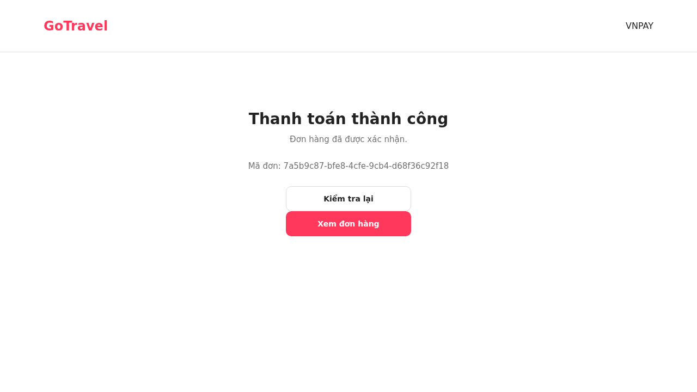

# Xác nhận luồng VNPAY Sandbox sau khi cập nhật IPN

## Kết quả

Đã thử giao dịch Sandbox mới ngày 06/10/2026, sau khi bạn cập nhật IPN URL trong VNPAY Sandbox SIT. Luồng thanh toán, IPN, notification xác nhận đơn và giữ chỗ đã hoạt động.

| Mục | Kết quả thực tế |
| --- | --- |
| Đơn kiểm thử | `7a5b9c87-bfe8-4cfe-9cb4-d68f36c92f18` |
| Payment | `39ea76fe-3afe-4514-8161-bb00487ebfe0` |
| Số tiền | 750.000đ |
| VNPAY transaction | `15696433` |
| Phương thức | Thẻ NCB Sandbox, OTP test do VNPAY công bố |
| Kết quả tại VNPAY | Response Code `00`, Transaction Status `00` |
| IPN thật từ VNPAY | Đã được xử lý; attempt `SUCCEEDED`, có thời điểm xử lý |
| Payment | `COMPLETED` |
| Order | `CONFIRMED` |
| Notification tới Order | Thành công và đã ghi nhận `deliveredAt` |
| Giữ chỗ | Hai bản ghi lịch của khoảng ngày 13–14/10 đều `CONFIRMED` |
| Ledger thanh toán | Một giao dịch, tổng tiền 750.000đ |
| Khoản doanh thu host | Một bản ghi payout |
| Trang Return | HTTP 200, backend xác minh chữ ký; chuyển từ `CONFIRMING` sang `SUCCESS`, `orderConfirmed=true` |

## Kiểm tra gửi callback lặp

Sau khi IPN thật đã được xử lý và đơn đã xác nhận, đã gửi lại cùng bộ tham số giao dịch có chữ ký thật từ VNPAY tới endpoint IPN để kiểm tra replay.

- HTTP 200, `RspCode=02`, `Message=Order already confirmed`.
- Database vẫn có đúng một transaction 750.000đ và một payout.
- Order vẫn `CONFIRMED`; số lần thử gửi email vẫn là 1, không phát sinh lần gửi mới do replay.

Đây là phép thử callback lặp sau giao dịch đã xác nhận. Việc xác nhận ban đầu được thực hiện bởi IPN thật từ VNPAY, không dựa trên việc tự gửi Return sang IPN.

## Giới hạn của lần thử

- Đây là Sandbox, không xác minh thu tiền Production hoặc hoàn tiền VNPAY.
- Đã dùng khách `VNPAY SANDBOX IPN TEST` và email `vnpay-sandbox-test@example.invalid`. Order đã thử gửi email một lần, `ticketEmailSent=false`; service email trả `INTERNAL_ERROR` cho fixture này. Chưa xác minh giao vé tới một hộp thư thật và chưa kết luận nguyên nhân lỗi email chỉ từ thử nghiệm này.
- QR đã được kiểm tra hiển thị đúng trong lần thử trước; lần này xác nhận luồng IPN bằng NCB, chưa thử hoàn tất giao dịch bằng ứng dụng quét QR.
- Bản ghi thanh toán Sandbox và đơn đã xác nhận được giữ để đối chiếu; không đánh dấu payout là đã chuyển tiền cho host và không hủy một đơn đã thanh toán bằng API hủy đơn chưa trả tiền.

## Bạn có thể tự thử tiếp

Tạo đơn mới trên GoTravel với ngày còn chỗ, thông tin và email của bạn → mở Payment Portal → thanh toán VNPAY → chọn NCB với thẻ `9704198526191432198`, tên `NGUYEN VAN A`, ngày phát hành `07/15`, OTP `123456`. Sau Return và IPN, trang kết quả phải báo đơn đã xác nhận. Thẻ test theo [VNPAY Sandbox](https://sandbox.vnpayment.vn/apis/vnpay-demo/).

Để hiện QR, chọn **App Ngân hàng và Ví điện tử (VNPAYQR)** trên cổng VNPAY. Muốn hoàn tất thao tác quét trong Sandbox, cần ứng dụng/tài khoản thử nghiệm phù hợp do VNPAY hỗ trợ; không dùng tiền thật cho phiên Sandbox.

Chi tiết đối chiếu API và database được lưu trong `VNPAY_IPN_CONFIRMED_TEST_2026-10-06.json`. Báo cáo trước `VNPAY_SANDBOX_LIVE_TEST_2026-10-06.md` ghi lại tình trạng thiếu IPN trước khi bạn cập nhật cấu hình; vấn đề đó đã được giải quyết trong lần thử mới này.
